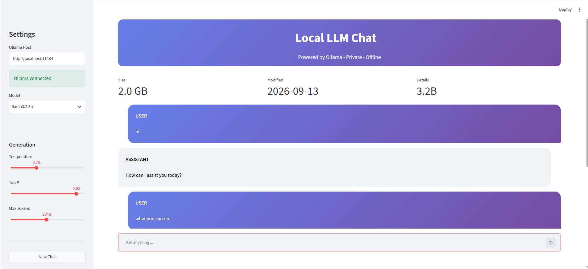
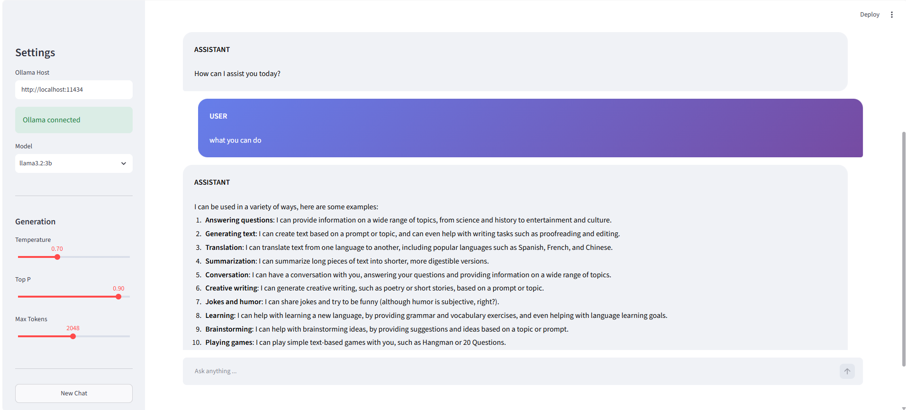

# Local LLM Chat

A Streamlit chat interface for [Ollama](https://ollama.com). Runs 100% locally - no data leaves your machine, no API keys, no cloud.


## Screenshots

<p align="center">
  
  
</p>

## Features

- Streaming chat responses
- Model picker (auto-detects installed Ollama models)
- Temperature, Top-P, and Max Tokens controls
- Model info panel (size, params, modified date)
- New Chat / history reset
- Works on Linux, macOS, and Windows

## Architecture

The application operates on a simple client-server model, optimized for local execution and real-time streaming.

```text
+-----------------------+
|         User          |
+-----------------------+
           |
           | Inputs Prompt / Adjusts Settings
           v
+-----------------------+
|   Streamlit Frontend  |
|     (app.py)          |
+-----------------------+
           |
           | 1. Constructs JSON Payload
           |    (messages, temperature, top_p, num_predict)
           |
           | 2. HTTP POST /api/chat (stream=true)
           v
+-----------------------+
|    Ollama Server      |
|  (localhost:11434)    |
+-----------------------+
           |
           | 3. Processes Payload
           v
+-----------------------+
|      Local LLM        |
|     (llama3.2:3b)     |
+-----------------------+
           |
           | 4. Generates Tokens sequentially
           | 5. Streams JSON chunks back to Streamlit
           v
+-----------------------+
|   Streamlit Frontend  |
|  Updates UI in real-  |
|  time via placeholder |
+-----------------------+
           |
           | 6. Saves assistant response
           |    to session state
           v
+-----------------------+
|         User          |
|    Views Response     |
+-----------------------+
